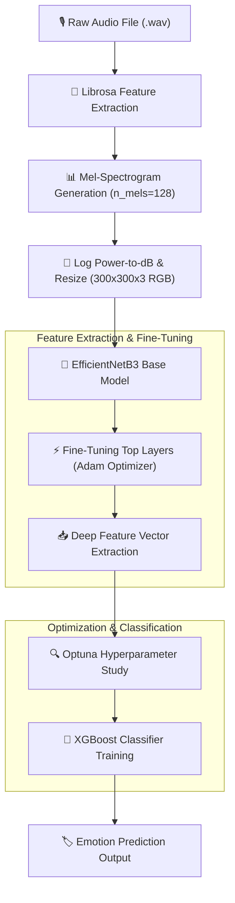

# 🎙️ Speech Emotion Recognition (SER) using Mel-Spectrograms & Hybrid Transfer Learning

[](https://www.python.org/)
[](https://www.tensorflow.org/)
[](https://xgboost.readthedocs.io/)
[](https://optuna.org/)
[](https://librosa.org/)
[](https://creativecommons.org/licenses/by-nc-sa/4.0/)

An advanced **Speech Emotion Recognition (SER)** research codebase utilizing 2D Mel-Spectrogram feature representations, deep CNN transfer learning (**EfficientNetB3**), automated hyperparameter optimization via **Optuna**, and a hybrid gradient boosting classifier (**XGBoost**). 

This project benchmarks baseline deep learning models against an enhanced hybrid architecture across two popular speech emotion datasets: **RAVDESS** and **TESS**, achieving outstanding classification accuracy of up to **99.64%**.

---

## 📌 Table of Contents

- [Overview](#-overview)
- [Key Features](#-key-features)
- [System Architecture](#-system-architecture)
- [Datasets](#-datasets)
- [Experimental Results](#-experimental-results)
- [Project Structure](#-project-structure)
- [Prerequisites & Installation](#-prerequisites--installation)
- [How to Run](#-how-to-run)
- [License & Acknowledgments](#-license--acknowledgments)

---

## 🔍 Overview

Speech Emotion Recognition (SER) plays a crucial role in Human-Computer Interaction (HCI), healthcare monitoring, customer sentiment analysis, and intelligent voice assistants. Standard 1D raw audio signals can be challenging to classify directly. 

This repository leverages **Mel-Spectrograms**—a 2D time-frequency representation of sound aligned with human hearing perception. By treating Mel-Spectrograms as image inputs, pre-trained Convolutional Neural Networks (**EfficientNetB3**) are employed for deep feature extraction. The extracted feature embeddings are then classified using an **Optuna-tuned XGBoost Classifier** for superior emotional discrimination.

---

## ✨ Key Features

- **Audio-to-Spectrogram Conversion**: Automated extraction of Mel-Spectrograms (`n_mels=128`, `fmax=8000`, `sr=22050 Hz`) converted to decibel scale (`power_to_db`) and expanded into 3-channel RGB image tensor inputs ($300 \times 300 \times 3$).
- **Deep Feature Extractor**: Fine-tuned **EfficientNetB3** pre-trained on ImageNet for rich multi-scale spatial feature learning.
- **Automated Hyperparameter Optimization**: Automated tuning of XGBoost hyperparameters (`n_estimators`, `learning_rate`, `max_depth`, `subsample`, `colsample_bytree`) powered by **Optuna**.
- **Hybrid Classifier (EfficientNetB3 + XGBoost)**: Combining CNN spatial representations with Gradient Boosted Decision Trees (GBDT) for state-of-the-art accuracy.
- **Multi-Dataset Benchmarking**: Comprehensive evaluations conducted on both **RAVDESS** and **TESS** benchmark datasets.

---

## 📐 System Architecture

The end-to-end classification pipeline follows the workflow below:



---

## 📊 Datasets

### 1. RAVDESS (Ryerson Audio-Visual Database of Emotional Speech and Song)
- **Total Classes (8)**: `neutral`, `calm`, `happy`, `sad`, `angry`, `fearful`, `disgust`, `surprised`
- **Speakers**: 24 professional actors (12 female, 12 male)
- **Audio Format**: 16-bit, 48kHz `.wav`

### 2. TESS (Toronto Emotional Speech Set)
- **Total Classes (7)**: `angry`, `disgust`, `fear`, `happy`, `neutral`, `pleasant surprise`, `sad`
- **Speakers**: 2 female actors (26 years old and 64 years old)
- **Audio Format**: `.wav`

---

## 📈 Experimental Results

The models were evaluated using **Accuracy**, **Weighted F1-Score**, and **Test Loss** metrics.

| Dataset | Model Architecture | Pipeline / Methods | Test Accuracy | Weighted F1-Score |
| :--- | :--- | :--- | :---: | :---: |
| **RAVDESS** | Baseline | Fine-Tuned EfficientNetB3 + Dense Softmax | ~85.24% | 0.8529 |
| **RAVDESS** | **Enhanced (Hybrid)** | **EfficientNetB3 + Optuna + XGBoost** | **99.64%** | **0.9964** |
| **TESS** | Baseline | Fine-Tuned EfficientNetB3 + Dense Softmax | 99.11% | 0.9911 |
| **TESS** | **Enhanced (Hybrid)** | **EfficientNetB3 + Optuna + XGBoost** | **99.64%** | **0.9964** |

> **Key Takeaway**: The **Enhanced Hybrid Model** combining EfficientNetB3 feature embeddings with Optuna-tuned XGBoost achieved remarkable classification performance, boosting RAVDESS accuracy from **85.24%** to **99.64%**.

---

## 📁 Project Structure

```dir
.
├── Emotional_Rec_Base_RAVDES_Final.ipynb       # RAVDESS Baseline Model (EfficientNetB3)
├── Emotional_Rec_RAVDES_Enhance_Final.ipynb    # RAVDESS Enhanced Model (EfficientNetB3 + Optuna + XGBoost)
├── Emotional_Rec_Base_TESS_Final.ipynb         # TESS Baseline Model (EfficientNetB3)
├── Emotional_Rec_TESS_Enhance_Final.ipynb      # TESS Enhanced Model (EfficientNetB3 + Optuna + XGBoost)
└── README.md                                   # Documentation
```

---

## 💻 Prerequisites & Installation

### Requirements
- Python 3.8 or higher
- NVIDIA GPU recommended for faster model training (e.g., CUDA-enabled GPU or Google Colab T4 GPU)

### 1. Clone the Repository
```bash
git clone https://github.com/your-username/Speech-Emotion-Recognition-Spectrogram.git
cd Speech-Emotion-Recognition-Spectrogram
```

### 2. Install Dependencies
Install all required libraries using `pip`:

```bash
pip install numpy pandas matplotlib seaborn librosa scikit-learn scikit-image tqdm tensorflow xgboost optuna
```

---

## 🚀 How to Run

1. **Launch Jupyter Notebook or Google Colab**:
   Open any of the project notebook files (`.ipynb`) in Google Colab or your local Jupyter environment.

2. **Dataset Setup**:
   The notebooks include Kaggle API integration commands to download datasets directly:
   - For RAVDESS: `!kaggle datasets download uwrfkaggler/ravdess-emotional-speech-audio`
   - For TESS: `!kaggle datasets download ejlok1/toronto-emotional-speech-set-tess`

3. **Run Pipeline Cells sequentially**:
   - Audio preprocessing & Spectrogram feature generation
   - Deep Feature Extraction via EfficientNetB3
   - Optuna study for hyperparameter tuning
   - Final XGBoost training & evaluation report generation

---

## 📄 License & Acknowledgments

- Datasets used in this study belong to their respective creators:
  - RAVDESS: [Ryerson Audio-Visual Database of Emotional Speech and Song](https://www.kaggle.com/datasets/uwrfkaggler/ravdess-emotional-speech-audio) (Licensed under CC-BY-NC-SA-4.0).
  - TESS: [Toronto Emotional Speech Set](https://www.kaggle.com/datasets/ejlok1/toronto-emotional-speech-set-tess).
- EfficientNet architecture powered by [TensorFlow Keras Applications](https://www.tensorflow.org/api_docs/python/tf/keras/applications).
- Hyperparameter tuning powered by [Optuna](https://optuna.org/).
